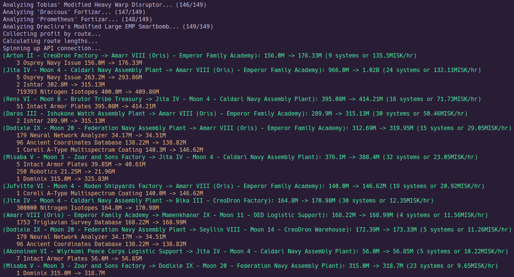

## Run Procedure
1. Follow guide at https://kyria.github.io/EsiPy/examples/sso_login_esipy/ on getting set up with SSO/API keys
2. Create a data/secrets.yaml file with the following structure:
- client_id: 
- secret_key:
- callback_url: 
- scopes: [...]
- refresh_token: 
3. Refresh token can be obtained by running refresh_auth.py, then copying the refresh token from the URL
4. Run get_orders.py
5. Run find_arbitrage.py

## Sample Output

## Conclusions
More study is needed - this only covers single source/sink trips and doesn't pick up items on the way, nor does it account for round trip times. There are also some methods to get around more quickly, like jump frigates using cynos, so the expected ISK/hr would likely go up contigent on fuel costs, the increased likelihood of being ganked, and the cyno cooldown.

However, with the limited scope I can see, it looks like the EVE marketplace is fairly efficient. The average values (around 20M ISK/hr) are pitifully low. A reasonably skilled player can make 200-300M ISK/hr ratting, and even exploration returns around 40-50M ISK/hr with Covert Ops. Due to the high downside risk (being blown up and everything being stolen) relative to those other methods, basic arbitrage does not seem particularly profitable.